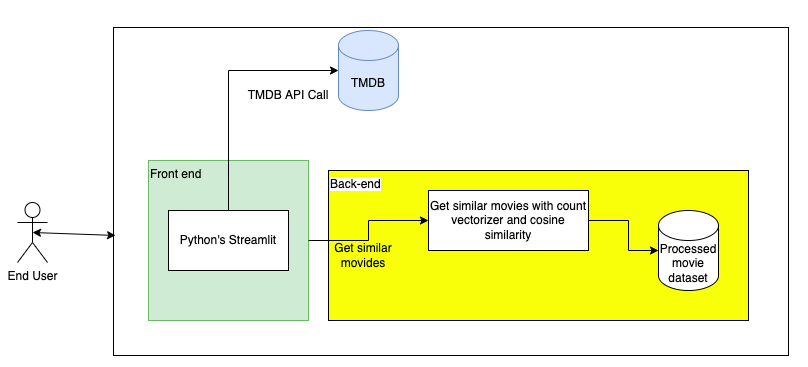
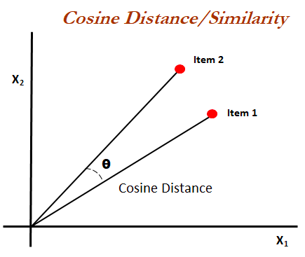

# movie-recommender-system
It is a content based movie recommender system using count vectorizer and cosine similarity

This repo includes two parts:
1. Use machine learning to build a content based movie recommender
2. Deploy the recommender to Heroku cloud platform

[Live demo](https://movie-recommender-meta-ai.herokuapp.com/)

[Dataset](https://www.kaggle.com/datasets/tmdb/tmdb-movie-metadata?select=tmdb_5000_movies.csv)

## Architecture

## Tech stacks:

**Front end**: Use **streamlit** to build a simple web application

**Recommender**: Use **count vectorizer** and **cosine similarity** to decide similarities between movies.

**Deployment**: Deploy the recommender to Heroku cloud platform

### What is Cosine Similarity?
Cosine similarity is a metric used to measure how similar the documents are irrespective of their size. Mathematically, it measures the cosine of the angle between two vectors projected in a multi-dimensional space. The cosine similarity is advantageous because even if the two similar documents are far apart by the Euclidean distance (due to the size of the document), chances are they may still be oriented closer together. The smaller the angle, higher the cosine similarity.

